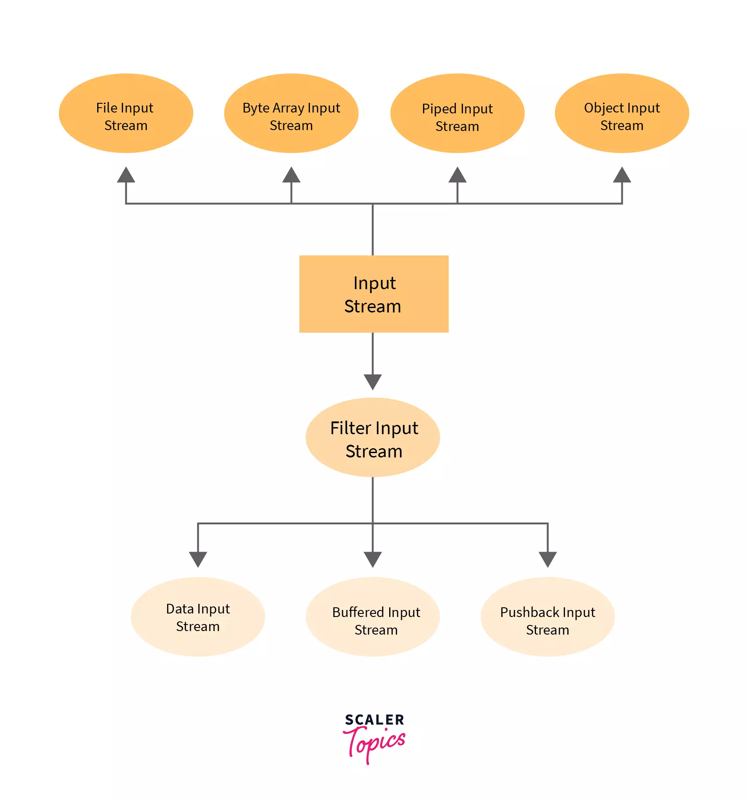
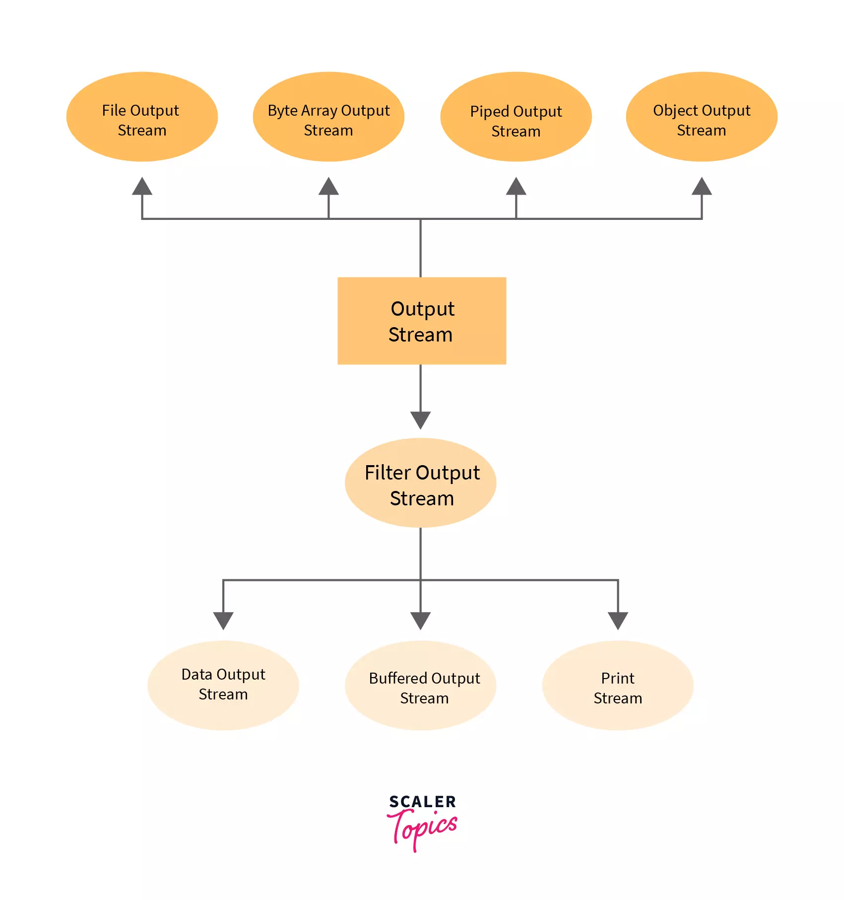
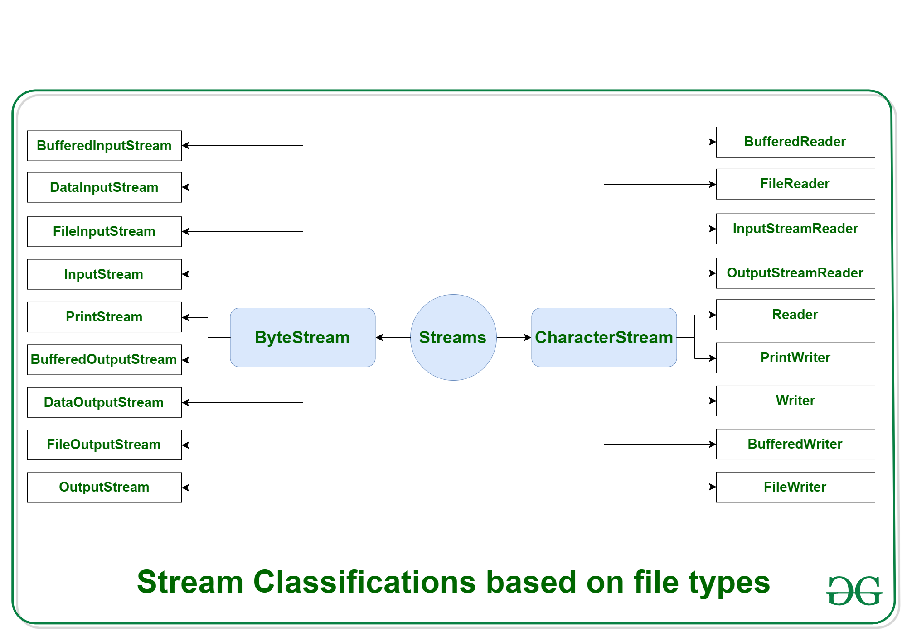

## Theory

- Java IO (Input and Output) is a core concept in Java programming that deals with the system's input and output operations.
- The Java IO package (`java.io`) contains classes and interfaces for handling different types of input and output operations such as reading from or writing to files, interacting with standard input and output streams, and working with various data formats.
- These streams support all the types of objects, data-types, characters, files etc to fully execute the I/O operations.

### Standard or Default streams

- In Java, 3 streams are created for us automatically. All these streams are attached with the console.

1. `System.in`: This is the standard input stream that is used to read characters from the keyboard or any other standard input device.

2. `System.out`: This is the standard output stream that is used to produce the result of a program on an output device like the computer screen.
   Here is a list of the various print functions used to output statements:

   1. `print()`: Displays text on the console, leaving the cursor at the end of the text.
      - Syntax: `System.out.print(parameter)`;
   2. `println()`: Displays text on the console and moves the cursor to the next line, so the next print starts from a new line.
   3. `printf()`: Similar to printf in C, it formats the output. Unlike print() and println(), printf() can take multiple arguments.

3. `System.err`: This is the standard error stream that is used to output all the error data that a program might throw, on a computer screen or any standard output device.
   This stream also uses all the 3 above-mentioned functions to output the error data:

   - `print()`
   - `println()`
   - `printf()`

### Streams

1. **Input Stream**:

   - It is an `abstract` superclass of the `java.io` package.
   - Used to read data from a source, like an array or file or any peripheral device.
   - For eg: FileInputStream, BufferedInputStream, ByteArrayInputStream etc.
   - Syntax: `InputStream f = new FileInputStream("input.txt");`
       

2. **Output Stream**:

   - It is an `abstract` superclass of the `java.io` package
   - Used to write data to a destination, like an array or file or any output peripheral device.
   - For eg., FileOutputStream, BufferedOutputStream, ByteArrayOutputStream etc.
       

Depending on the types of file, `Streams` can be divided into two primary classes which can be further divided into other classes as can be seen through the diagram below
 

1. **Byte Streams**:

   - Handle input and output of raw binary data.
   - Process data byte by byte (8 bits).
   - `FileInputStream` and the `FileOutputStream` are the most popular Byte Streams.
   - Various `ByteStream` Classes:
     1. `BufferedInputStream`: It is used for Buffered Input Stream.
     2. `DataInputStream`: It contains method for reading java standard datatypes.
     3. `FileInputStream`: This is used to reads from a file
     4. `InputStream`: This is an abstract class that describes stream input.
     5. `PrintStream`: This contains the most used print() and println() method
     6. `BufferedOutputStream`: This is used for Buffered Output Stream.
     7. `DataOutputStream`: This contains method for writing java standard data types.
     8. `FileOutputStream`: This is used to write to a file.
     9. `OutputStream`: This is an abstract class that describe stream output.

2. **Character Streams**:
   - Handle input and output of character data (text).
   - In Java, characters are stored using Unicode conventions.
   - `FileReader` and the `FileWriter` are the most popular Character Streams.
   - Various `CharacterStream` Classes:
     1. `BufferedReader`: It is used to handle buffered input stream.
     2. `FileReader`: This is an input stream that reads from file.
     3. `InputStreamReader`: This input stream is used to translate byte to character.
     4. `OutputStreamReader`: This output stream is used to translate character to byte.
     5. `Reader`: This is an abstract class that define character stream input.
     6. `PrintWriter`: This contains the most used print() and println() method
     7. `Writer`: This is an abstract class that define character stream output.
     8. `BufferedWriter`: This is used to handle buffered output stream.
     9. `FileWriter`: This is used to output stream that writes to file.

### **Core Classes**:

- **File**: Represents a file or directory path.
- **FileInputStream**: Reads raw byte data from a file.
- **FileOutputStream**: Writes raw byte data to a file.
- **ObjectInputStream**: Read objects from a byte stream.
- **ObjectOutputStream**: Write objects to a byte stream.
- **BufferedInputStream**: Buffers input byte data to improve performance.
- **BufferedOutputStream**: Buffers output byte data to improve performance.
- **FileReader**: Reads character data from a file.
- **FileWriter**: Writes character data to a file.
- **BufferedReader**: Buffers input character data to improve performance.
- **BufferedWriter**: Buffers output character data to improve performance.
