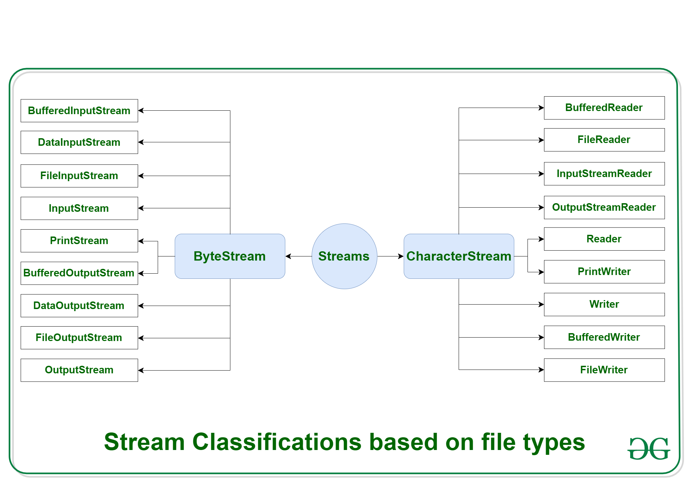
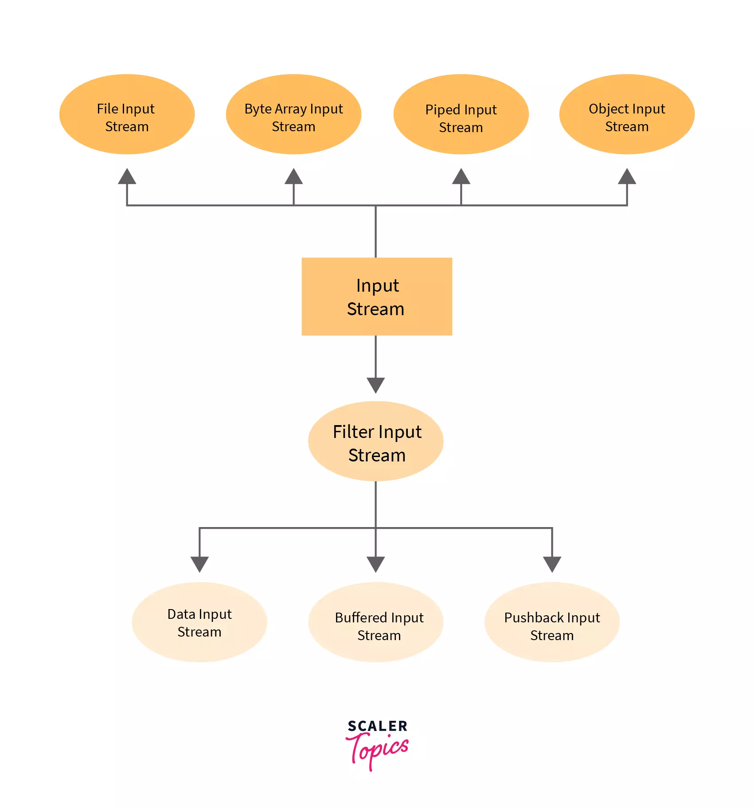
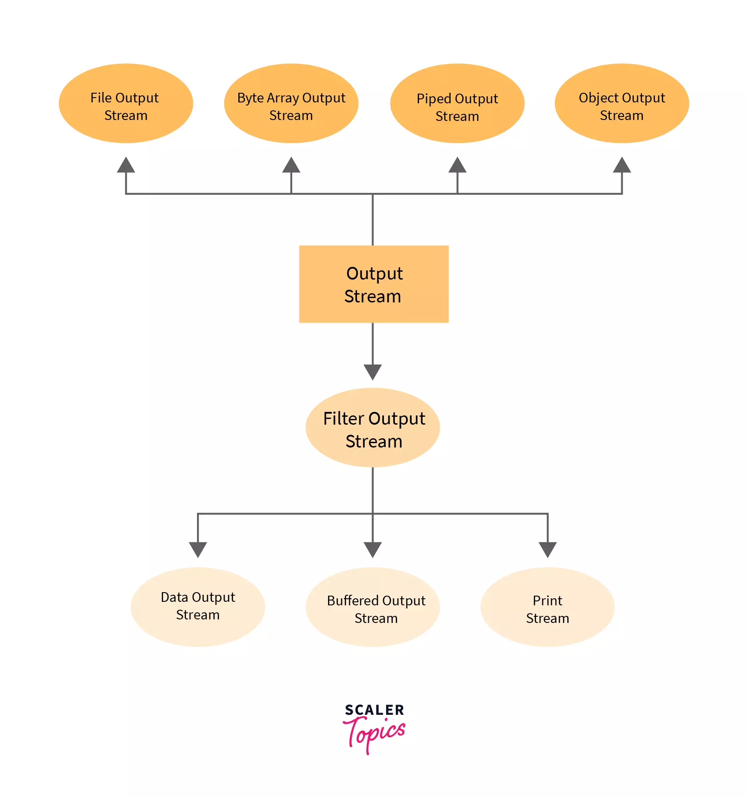

# Java I/O (Input and Output)

- Java I/O (Input and Output) is an essential part of the Java platform and is used to process input and produce output.
- The Java I/O package (`java.io`) provides classes for system input and output through data streams, serialization, and the file system.
- Java's I/O API covers reading from and writing to files, console, network connections, and more.
- Java I/O is built around streams, which represent sequences of data.
- These streams are classified into byte streams (for raw data) and character streams (for text data).
- Java's I/O framework is also designed to handle buffered input/output for efficient reading and writing.

## Standard or Default streams

- In Java, 3 streams are created for us automatically. All these streams are attached with the console.

### 1. `System.in`

- Standard input stream that is used to read characters from the keyboard or any other standard input device.

### 2. `System.out`

- Standard output stream that is used to produce the result of a program on an output device, usually the console.
- Methods:

  1.  `print()`: Displays text on the console, leaving the cursor at the end of the text.
      - Syntax: `System.out.print(parameter)`;
  2.  `println()`: Displays text on the console and moves the cursor to the next line.
  3.  `printf()`: Formats the output. Unlike print() and println(), printf() can take multiple arguments.

### 3. `System.err`

- Standard error stream that is used to output the error data that a program might throw (usually the console).
- Methods:

  1.  `print()`
  2.  `println()`
  3.  `printf()`

## Streams in Java

- Java I/O revolves around the concept of streams. Streams are an abstraction to facilitate the reading and writing of data.
- Depending on the types of file, `Streams` can be divided into two primary classes which can be further divided into other classes.

1. **Byte Streams**: Used for handling binary data (e.g., images, videos, etc.).
2. **Character Streams**: Used for handling text data (e.g., strings).

<br/>

### 1. Byte Streams

Byte streams handle data in 8-bit `bytes`. All byte stream classes are descended from the `InputStream` and `OutputStream` classes. They are primarily used for handling raw binary data, such as images or audio files.

1. **`InputStream`**

   - It is an `abstract` class of the `java.io` package for reading byte streams.
   - Used to read data from a source, like an array or file or any peripheral device.
   - Syntax: `InputStream f = new FileInputStream("input.txt");`
     <br/><br/>

2. **`OutputStream`**
   - It is an `abstract` class of the `java.io` package for writing byte streams.
   - Used to write data to a destination, like an array or file or any output peripheral device.
     <br/><br/>

#### Important Byte Stream Classes:

- `FileInputStream`: Reads bytes from a file.
- `FileOutputStream`: Writes bytes to a file.
- `BufferedInputStream`: Buffers the input stream to enhance performance.
- `BufferedOutputStream`: Buffers the output stream to enhance performance.
- `ByteArrayInputStream`: Reads bytes from a byte array.
- `ByteArrayOutputStream`: Writes bytes to a byte array.

#### Example of `FileInputStream` and `FileOutputStream`:

```java
import java.io.FileInputStream;
import java.io.FileOutputStream;
import java.io.IOException;

public class ByteStreamExample {
    public static void main(String[] args) {
        try (FileInputStream fis = new FileInputStream("input.txt");
             FileOutputStream fos = new FileOutputStream("output.txt")) {

            int byteData;
            while ((byteData = fis.read()) != -1) {
                fos.write(byteData);
            }

            System.out.println("File copied successfully.");
        } catch (IOException e) {
            e.printStackTrace();
        }
    }
}
```

### 2. Character Streams

Character streams handle data in 16-bit `char` units. Character stream classes are descended from the `Reader` and `Writer` classes. These streams are more suitable for reading and writing text files, ensuring correct handling of Unicode characters.

- `Reader`: Abstract class for reading character streams.
- `Writer`: Abstract class for writing character streams.

#### Important Character Stream Classes:

- `FileReader`: Reads characters from a file.
- `FileWriter`: Writes characters to a file.
- `BufferedReader`: Buffers the character input stream to enhance performance.
- `BufferedWriter`: Buffers the character output stream to enhance performance.
- `InputStreamReader`: This input stream is used to translate byte to character.
- `OutputStreamReader`: This output stream is used to translate character to byte.

#### Example of FileReader and FileWriter:

```java
import java.io.FileReader;
import java.io.FileWriter;
import java.io.IOException;

public class CharacterStreamExample {
    public static void main(String[] args) {
        try (FileReader reader = new FileReader("input.txt");
             FileWriter writer = new FileWriter("output.txt")) {

            int characterData;
            while ((characterData = reader.read()) != -1) {
                writer.write(characterData);
            }

            System.out.println("File copied using character streams.");
        } catch (IOException e) {
            e.printStackTrace();
        }
    }
}
```

### **Core Classes**:

- **File**: Represents a file or directory path.
- **FileInputStream**: Reads raw byte data from a file.
- **FileOutputStream**: Writes raw byte data to a file.
- **ObjectInputStream**: Read objects from a byte stream.
- **ObjectOutputStream**: Write objects to a byte stream.
- **BufferedInputStream**: Buffers input byte data to improve performance.
- **BufferedOutputStream**: Buffers output byte data to improve performance.
- **FileReader**: Reads character data from a file.
- **FileWriter**: Writes character data to a file.
- **BufferedReader**: Buffers input character data to improve performance.
- **BufferedWriter**: Buffers output character data to improve performance.

## Buffered Streams

Buffered streams are used to optimize input and output operations by reducing the number of I/O operations. Buffered streams wrap other input/output streams and improve performance by reading or writing large chunks of data at once, instead of reading or writing byte-by-byte or character-by-character.

### Important Buffered Stream Classes:

- `BufferedInputStream` and `BufferedOutputStream` (for byte streams).
- `BufferedReader` and `BufferedWriter` (for character streams).

#### Example with BufferedReader and BufferedWriter:

```java
import java.io.BufferedReader;
import java.io.BufferedWriter;
import java.io.FileReader;
import java.io.FileWriter;
import java.io.IOException;

public class BufferedStreamExample {
    public static void main(String[] args) {
        try (BufferedReader reader = new BufferedReader(new FileReader("input.txt"));
             BufferedWriter writer = new BufferedWriter(new FileWriter("output.txt"))) {

            String line;
            while ((line = reader.readLine()) != null) {
                writer.write(line);
                writer.newLine();
            }

            System.out.println("File copied using buffered character streams.");
        } catch (IOException e) {
            e.printStackTrace();
        }
    }
}
```

## File I/O

Java provides extensive support for file handling, allowing reading from and writing to files. File I/O involves classes like `File`, `FileReader`, `FileWriter`, `FileInputStream`, and `FileOutputStream`.

## Serialization

Serialization is the process of converting an object's state into a byte stream, so that it can be stored in a file or transmitted over a network. The reverse process, deserialization, involves reconstructing the object from the byte stream.

### Steps to Implement Serialization:

1. Implement the `Serializable` interface in the class to be serialized.
2. Use `ObjectOutputStream` to serialize the object.
3. Use `ObjectInputStream` to deserialize the object.

### Example of Serialization and Deserialization:

```java
import java.io.*;

class Person implements Serializable {
    private static final long serialVersionUID = 1L;
    String name;
    int age;

    public Person(String name, int age) {
        this.name = name;
        this.age = age;
    }

    public String toString() {
        return "Person[name=" + name + ", age=" + age + "]";
    }
}

public class SerializationExample {
    public static void main(String[] args) {
        Person person = new Person("John Doe", 30);

        // Serialization
        try (ObjectOutputStream oos = new ObjectOutputStream(new FileOutputStream("person.ser"))) {
            oos.writeObject(person);
            System.out.println("Object has been serialized: " + person);
        } catch (IOException e) {
            e.printStackTrace();
        }

        // Deserialization
        try (ObjectInputStream ois = new ObjectInputStream(new FileInputStream("person.ser"))) {
            Person deserializedPerson = (Person) ois.readObject();
            System.out.println("Object has been deserialized: " + deserializedPerson);
        } catch (IOException | ClassNotFoundException e) {
            e.printStackTrace();
        }
    }
}
```

## Java NIO (New I/O)

Java NIO (introduced in Java 1.4) provides a non-blocking, buffer-oriented I/O framework that works with channels, buffers, and selectors. It is faster and more scalable for handling large I/O operations, particularly in networking applications.

### Key NIO Components:

- Buffers: Containers for data.
- Channels: Represent connections to entities capable of performing I/O operations (e.g., files, sockets).
- Selectors: Allow a single thread to monitor multiple channels for events.

## Summary

Java I/O is a powerful API for performing input and output operations. The java.io package provides classes for both byte and character streams, supporting a wide range of data types. Buffered streams improve performance, while standard streams facilitate console-based I/O. Java also supports file handling, serialization, and non-blocking I/O through Java NIO, offering flexibility for a wide range of use cases.
