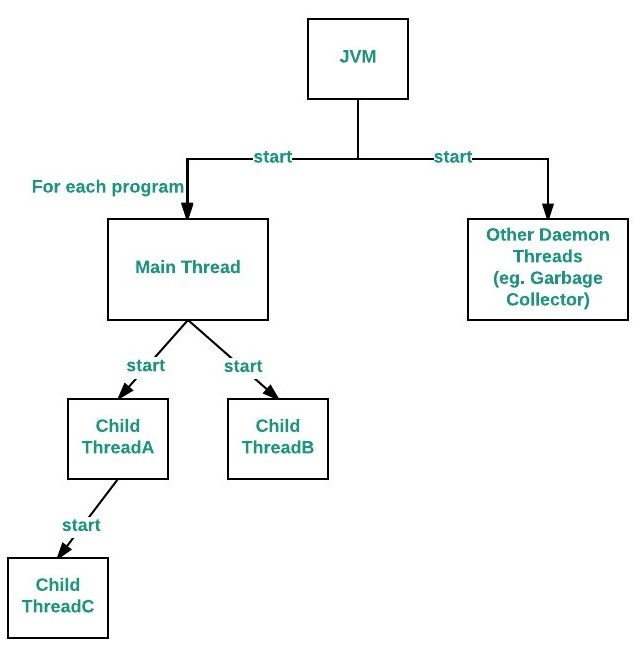

# Main Thread in Java

## Theory

### What is the Main Thread?

- **Main Thread**: The primary thread from which other child threads originate. It is the first thread that gets executed when a Java application starts.
- It is responsible for executing the `main()` method.

### Key Points

- **Entry Point**: The main thread is the entry point for any standalone Java application.
- **Default Thread**: When a Java application starts, one thread (the main thread) is automatically created.
- **Child Threads**: The main thread can create child threads.
- **Termination**: The Java program terminates when the main thread terminates, even if child threads are still running (unless the child threads are daemon threads).

### Methods

- `Thread.currentThread()`: Returns a reference to the currently executing thread object. We can get the reference to `main` class using this.
- `setName(String name)`: Sets the name of the thread.
- `getName()`: Returns the name of the thread.
- `setPriority(int newPriority)`: Sets the priority of the thread.
- `getPriority()`: Returns the priority of the thread.
- `isAlive()`: Tests if this thread is alive.



### Relationship between the main() method and the main thread -

For each program, a Main thread is created by JVM(Java Virtual Machine). The “Main” thread first verifies the existence of the main() method, and then it initializes the class. <br/>
From JDK 6, main() method is mandatory in a standalone java application.

### Notes:

1. You can make `main` thread go into a deadlock with itself using `Thread.currentThread().join();`

### Example

```java
public class MainThread extends Thread {
	public static void main(String[] args)
	{
		// Getting reference to Main thread
		Thread t = Thread.currentThread();

		System.out.println("Current thread: " + t.getName());

		t.setName("Geeks");
		System.out.println("After name change: " + t.getName());

		System.out.println("Main thread priority: " + t.getPriority());

		// Setting priority of Main thread to MAX(10)
		t.setPriority(MAX_PRIORITY);

		System.out.println("Main thread new priority: " + t.getPriority());

		for (int i = 0; i < 5; i++) {
			System.out.println("Main thread");
		}

		// Main thread creating a child thread
		Thread ct = new Thread() {
			// run() method of a thread
			public void run()
			{
				for (int i = 0; i < 5; i++) {
					System.out.println("Child thread");
				}
			}
		};

		// Getting priority of child thread which will be inherited from Main thread as it is created by Main thread
		System.out.println("Child thread priority: " + ct.getPriority());

		// Setting priority of Main thread to MIN(1)
		ct.setPriority(MIN_PRIORITY);

		System.out.println("Child thread new priority: " + ct.getPriority());

		ct.start();
	}
}

```
