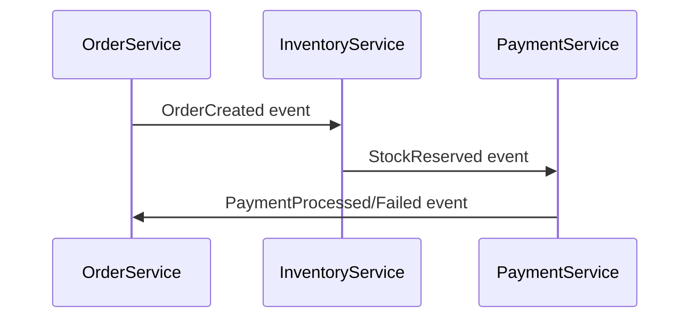
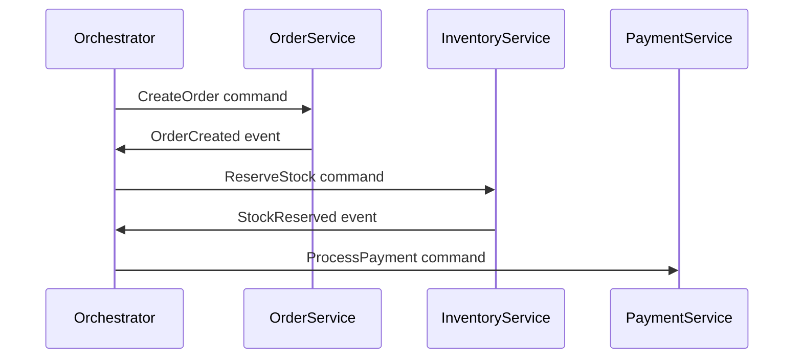

# Saga Pattern in Microservices

## 1. Introduction

In a **microservices architecture**, services are independent, and each has its own database. This independence can complicate **distributed transactions**, as there's no single database transaction that spans multiple services. The **Saga Pattern** is a solution that ensures data consistency across services without relying on distributed transactions, providing a way to maintain consistency in a **long-running business process**.

---

## 2. What is the Saga Pattern?

A **saga** is a sequence of **local transactions** where each transaction updates data within a microservice and publishes an event or triggers the next step in the saga. If a step fails, compensating transactions are executed to undo the changes made by the previous transactions.

A saga is essentially a **long-lived transaction**, broken into a series of smaller, independent steps with compensating actions for error recovery.

---

## 3. Types of Saga Patterns

There are two main approaches to implementing the saga pattern in microservices:

### a. Choreography-Based Saga

In a **choreography-based saga**, each service is responsible for executing its own local transaction and producing events to notify other services of state changes. These events trigger the next service in the saga to perform its part of the transaction.

#### Example:

1. **Order Service** creates an order and emits an `OrderCreated` event.
2. **Inventory Service** receives the event, reserves stock, and emits a `StockReserved` event.
3. **Payment Service** receives the `StockReserved` event, processes the payment, and emits a `PaymentProcessed` event.
4. If the payment fails, a `PaymentFailed` event is emitted, and compensating transactions are triggered (e.g., the Inventory Service releases the reserved stock).



#### Advantages:

- Decentralized logic.
- Simple to implement with event-driven systems.

#### Disadvantages:

- Harder to trace and manage.
- More complex error handling due to lack of central control.

### b. Orchestration-Based Saga

In an **orchestration-based saga**, a central orchestrator controls the flow of the transactions. The orchestrator sends commands to services, and they perform local transactions and report back success or failure. The orchestrator manages the saga's state and decides how to handle failures.

#### Example:

1. The **Order Orchestrator** starts the transaction by sending a command to the Order Service to create an order.
2. The **Order Service** processes the command and informs the orchestrator of success.
3. The orchestrator then sends a command to the **Inventory Service** to reserve stock, followed by the **Payment Service** to process payment.
4. If any service fails, the orchestrator initiates compensating transactions to roll back the operation.



#### Advantages:

- Centralized coordination makes error handling easier.
- Easier to track the saga's progress.

#### Disadvantages:

- Single point of failure (orchestrator).
- More complex to implement than choreography.

## 4. When to Use the Saga Pattern?

The **Saga Pattern** is used in distributed systems where you need to:

- Maintain data consistency across multiple services.
- Avoid long-running distributed transactions (due to issues like performance and reliability).
- Handle long-running business processes that span multiple microservices.
- Ensure the ability to roll back changes using compensating transactions.

## 5. Saga Example in a Distributed System

Let's consider an e-commerce platform where the following actions happen:

1. Order Service creates an order.
2. Inventory Service reserves the stock.
3. Payment Service processes the payment.
4. Shipping Service arranges the shipment.

### Step-by-Step Saga Process:

- **Choreography**: Each service listens for events (e.g., `OrderCreated`, `StockReserved`, `PaymentProcessed`) and executes the next step.
- **Orchestration**: An Order Orchestrator sends commands to each service to execute in sequence.

### Error Handling:

- If the payment fails, the saga rolls back:
  - Inventory Service releases the reserved stock.
  - Order Service marks the order as canceled.
  - Shipping Service cancels the shipment.

## 6. Benefits of the Saga Pattern

| Benefit                 | Description                                                                                                                                        |
| ----------------------- | -------------------------------------------------------------------------------------------------------------------------------------------------- |
| Decoupling              | Each service executes its local transaction independently, ensuring loose coupling.                                                                |
| Resilience              | If a failure occurs, compensating transactions ensure that data remains consistent across microservices.                                           |
| Scalability             | Each microservice can be scaled independently, as no global transaction management is required.                                                    |
| Asynchronous Processing | In the choreography approach, services communicate asynchronously through events, which allows them to process requests without blocking.          |
| Consistency             | The saga pattern helps to maintain eventual consistency across distributed systems, ensuring that all systems reach a consistent state eventually. |

## 7. Challenges of the Saga Pattern

| Challenge                  | Description                                                                                                                      |
| -------------------------- | -------------------------------------------------------------------------------------------------------------------------------- |
| Compensating Transactions  | Designing compensating transactions is complex, as it requires undoing completed work in the event of a failure.                 |
| Data Consistency           | The saga pattern provides eventual consistency, which means that data might not be immediately consistent across all services.   |
| Complexity in Choreography | The choreography approach can lead to complex systems, with each service needing to listen for and react to a variety of events. |
| Performance Overhead       | The saga pattern introduces overhead due to the additional coordination required between services and compensating transactions. |
| Orchestrator               | Bottleneck In an orchestration-based saga, the orchestrator can become a bottleneck or a single point of failure.                |

## 8. Compensating Transactions

In a saga, if one step fails, compensating transactions are needed to undo the previous steps. These are essentially reverse actions that restore the system to its original state.

### Example:

If a payment fails, the inventory reservation must be canceled, and the order status updated to reflect the cancellation.

```java
public void cancelInventoryReservation(Long orderId) {
    // Logic to cancel the stock reservation for the order
    inventoryService.releaseStock(orderId);
}

public void markOrderAsCancelled(Long orderId) {
    // Logic to mark the order as cancelled
    orderService.updateOrderStatus(orderId, "CANCELLED");
}
```

## 9. Saga Pattern and Eventual Consistency

The Saga Pattern typically provides eventual consistency rather than strong consistency. This means that while the system may not always be in a consistent state immediately, it will eventually reach a consistent state once all the steps of the saga are complete (or successfully rolled back).

## 10. Real-World Usage of Saga Pattern

Many large-scale systems use the saga pattern for distributed transactions, including:

- E-commerce platforms: To manage orders, payments, and inventory across services.
- Banking systems: To handle transactions, funds transfers, and account updates across multiple systems.
- Travel booking platforms: To coordinate booking processes across flight, hotel, and car rental services.

## 11. Conclusion

The Saga Pattern is a powerful solution for managing distributed transactions across microservices. It provides a way to maintain data consistency while ensuring each microservice remains autonomous. The choice between choreography and orchestration depends on the system's complexity, fault tolerance needs, and performance requirements.
